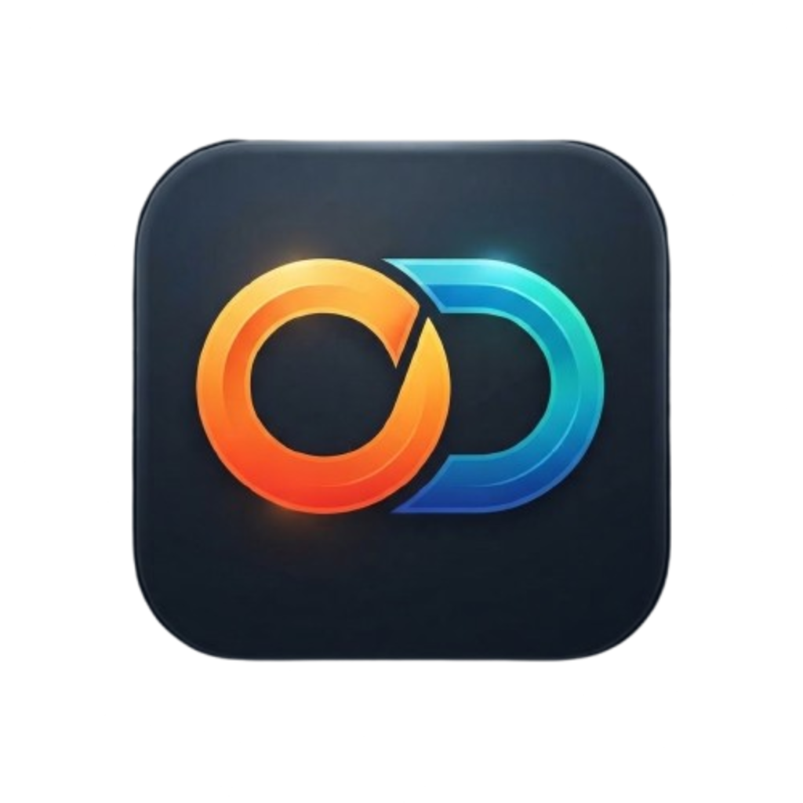

<p align="center">
  
</p>

<h1 align="center">Organizador Diario</h1>

<p align="center">
  Organiza tu día a día con un calendario, tareas con horario y<br>
  <strong>notificaciones locales que te avisan de cuándo cambiar de tarea</strong>.
</p>

<p align="center">
  
  
  
  
</p>

---

## 📲 Prueba la app

<p align="center">
  
  <br>
  <b>QR 1 — Expo Go:</b> carga la última actualización (canal <code>production</code>, runtime 1.0.0)
  <br>
  <small>código <code>exp://u.expo.dev/…?channel-name=production&runtime-version=1.0.0</code></small>
</p>

<p align="center">
  
  <br>
  <b>QR 2 — APK:</b> descarga e instala el <a href="https://github.com/Ghuinz17/organizador-diario/releases/download/v1.0.0/organizador-diario-v1.0.0.apk">APK v1.0.0</a> del release
  <br>
  <small>permite «orígenes desconocidos» en Android para instalarlo</small>
</p>

1. Instala **[Expo Go](https://expo.dev/go)** desde Play Store o App Store (es gratis).
2. *(Solo la primera vez — SDK 57)* inicia sesión en Expo Go con tu cuenta de Expo si te lo pide.
3. Escanea el **QR 1** con la cámara y elige «Abrir en Expo Go», o escanea el **QR 2** para instalar el APK directamente.

> El QR 1 no abre una página web: codifica un enlace `exp://` de EAS Update que carga la última actualización publicada del canal `production` directamente en Expo Go.

<details>
<summary><b>O ejecutarla en local con el QR del terminal</b></summary>

```bash
git clone https://github.com/Ghuinz17/organizador-diario.git
cd organizador-diario
npm install
npx expo start
```

Escanea con Expo Go el QR que aparece en la terminal (el móvil y el PC deben estar en la misma red, o usa `npx expo start --tunnel`).
</details>

---

## 🧭 Cómo funciona la aplicación

### 1. Calendario (pantalla principal)

- Vista de mes con **puntos de color** en cada día que tiene tareas (el color corresponde a la primera tarea del día).
- Al tocar un día se selecciona y debajo aparece el resumen de sus tareas ordenadas por hora.
- Botones **«Gestionar día»** (abre la agenda de ese día) y **«Nueva tarea»**.
- En la cabecera: el **selector de idioma 🇪🇸 ES / 🇬🇧 EN** y el **selector de tema ☀️/🌙**.

### 2. Tareas

- Cada tarea tiene **título, fecha, horario, color y notas opcionales**.
- Dos modos de horario que elige el usuario en el formulario:
  - **Inicio y fin** → bloque de tiempo (`09:00 – 10:00`).
  - **Hora fija** → una hora concreta (`09:00 · hora fija`), sin hora de fin.
- **Editar**: toca la tarjeta de la tarea (queda resaltada con la etiqueta «editando»).
- **Eliminar**: icono de papelera en la tarjeta o botón «Eliminar tarea» dentro del formulario, siempre con diálogo de confirmación.
- Las tareas guardadas con versiones antiguas de la app se **migran automáticamente** al cargar.

### 3. Notificaciones de cambio de tarea

Al crear, editar o eliminar una tarea **se reprograman todos los avisos**:

- Cada tarea genera un aviso local en su **hora de inicio** (solo se programan horas futuras).
- El cuerpo del aviso indica la transición: **«Termina «X» → empieza «Y»»** (o «Comienza «X»» si es la primera del día).
- Al tocar el aviso, la app se abre directamente en la agenda de ese día.
- Botón **«Probar notificación (5 s)»** en la pantalla del día para verificar que el sistema funciona.
- En Android se crea el canal *«Cambios de tarea»* con prioridad máxima y la app pide los permisos necesarios (`SCHEDULE_EXACT_ALARM`, `RECEIVE_BOOT_COMPLETED`).

> **Nota sobre Expo Go:** verás un aviso en consola del tipo *"`expo-notifications` functionality is not fully supported in Expo Go"*. Se emite automáticamente al importar la librería dentro de Expo Go, es **informativo** y no afecta a las notificaciones locales. Para máxima fiabilidad (alarmas exactas en segundo plano) usa un [development build](https://expo.dev/fyi/dev-client).

### 4. Temas claro / oscuro

- Dos paletas **basadas en azul** (`#2563EB` en claro, `#60A5FA` en oscuro).
- Botón ☀️ **sol** en tema claro / 🌙 **luna** en tema oscuro; la elección **se guarda** y se aplica al reiniciar.
- También respeta el sistema si es la primera vez que se abre.

### 5. Idiomas: castellano e inglés

- Chip de bandera **🇪🇸 ES ↔ 🇬🇧 EN** en la cabecera (solo esos dos idiomas).
- Se traduce **toda la app**: interfaz, formularios, alertas, fechas y **las propias notificaciones** (se reprograman al cambiar de idioma).
- El calendario cambia a mes y días en castellano o inglés.
- La preferencia **se guarda** entre sesiones.

### 6. Tus datos, en tu móvil

Todo se guarda localmente con `AsyncStorage` (tareas, tema e idioma). **No hay servidor ni cuenta**: si desinstalas la app, se borran.

---

## 🛠 Instalación

**Requisitos:** Node.js 20+, npm y una app con **Expo Go** instalada en el móvil (o emulador Android/iOS).

```bash
git clone https://github.com/Ghuinz17/organizador-diario.git
cd organizador-diario
npm install
npx expo start
```

| Comando               | Descripción                              |
| --------------------- | ---------------------------------------- |
| `npx expo start`      | Arranca el servidor de desarrollo        |
| `npx expo start --android` / `--ios`  | Abre directamente en el dispositivo/emulador |
| `npx expo start --web`| Versión web en el navegador               |
| `npm run lint`        | Lint con ESLint (config Expo)            |
| `npx tsc --noEmit`    | Comprobación de tipos                    |
| `npx expo-doctor`     | Diagnóstico de dependencias y config     |

---

## 📂 Estructura del proyecto

```
organizador-diario/
├── app.json               # Config de Expo: icono, splash, plugins, permisos, EAS
├── eas.json               # Perfiles de EAS Build y canales de EAS Update
├── assets/                # Icono, logo, splash y QR de descarga
└── src/
    ├── app/               # Rutas (Expo Router) — envoltorios finos
    │   ├── _layout.tsx    #   providers (tema, i18n, tareas) + navegación
    │   ├── index.tsx      #   → CalendarScreen
    │   └── task/[date]/   #   → TaskScreen (deep-link desde notificaciones)
    ├── screens/           # CalendarScreen, TaskScreen
    ├── components/        # CalendarView, TaskCard, TaskForm, TimePickerField,
    │                      # ThemeToggle, LanguageToggle
    ├── context/           # TasksContext (tareas + reprogramación de avisos)
    ├── i18n/              # Diccionarios ES/EN + LocaleConfig del calendario
    ├── services/          # notificationManager, taskStore (AsyncStorage)
    ├── theme/             # Paletas colors.ts + ThemeContext (sol/luna)
    ├── types/             # Modelo Task (timeMode: 'range' | 'fixed')
    └── utils/             # Fechas (formato ES/EN, HH:mm, unión fecha+hora)
```

---

## 🚀 Publicar con EAS

El proyecto está vinculado a la cuenta **[`@amolper`](https://expo.dev/accounts/amolper/projects/organizador-diario)** (el panel requiere iniciar sesión) y ya tiene una actualización publicada en el canal `production`.

```bash
# Actualización de JS/sin nativos (segundos, sin compilar)
npx eas-cli@latest update --channel production --message "Descripción del cambio" --environment production

# Compilar APK de prueba (interna) / build de producción
npx eas-cli@latest build --platform android --profile preview
npx eas-cli@latest build --platform android --profile production

# Subir a tiendas
npx eas-cli@latest submit --platform android
```

---

## 📚 Tecnologías

- **[Expo SDK 57](https://docs.expo.dev/)** + **React Native 0.86** + **TypeScript 6**
- **[Expo Router](https://docs.expo.dev/router/introduction/)** — navegación por rutas en `src/app`
- **[expo-notifications](https://docs.expo.dev/versions/latest/sdk/notifications/)** — notificaciones locales programadas
- **[react-native-calendars](https://github.com/wix/react-native-calendars)** — calendario con locales ES/EN
- **[AsyncStorage](https://react-native-async-storage.github.io/async-storage/)** — persistencia local
- **EAS Update + EAS Build** — actualizaciones OTA y compilaciones en la nube

---

## 📄 Licencia

Distribuido bajo la [licencia MIT](LICENSE). © 2026 Ghuinz17.
